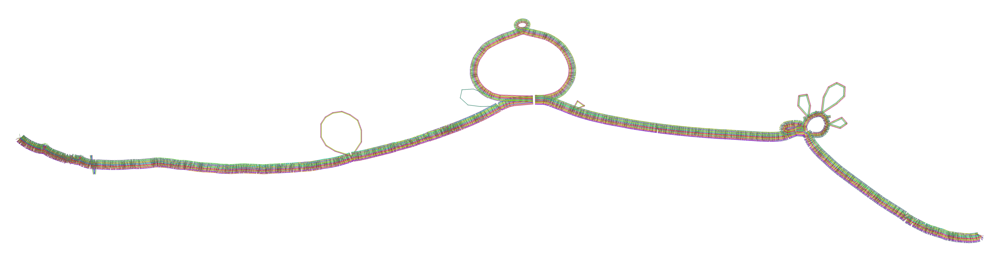

# 1_Intro,Zoe: Pangenome Graphs Workshop 

This repository includes sample datasets and scripts, which are utilized for the construction of pangenome graphs. It provides a comprehensive walkthrough of each step executed within the NeSI environment.

# Pangenome Graphs Workshop

Unlock the Power of Pangenome Graphs in Bioinformatics

<small>Example of pangenome graph in 2D visulization</small>

Don't let reference bias hinder your genomic analysis! Discover the cutting-edge potential of pangenome graphs in our pangenome workshop. 
 
In the field of bioinformatics, relying on a single reference genome can lead to significant oversights in genome variability and relationships. Luckily, recent advancements in assembly methods have made generating high-quality complete genome assemblies more accessible than ever before. Now is the time to leverage the full potential of pangenome graphs. 
 
Our workshop delves into the construction of dynamic pangenome graphs that incorporate multiple genomes and their alignments. By representing all types of variations within a graph structure, pangenome graphs provide an efficient model for analyzing complex genomic data.
 
Throughout the workshop, we will guide you through a practical pangenome bioinformatics pipeline, utilizing the PanGenome Graph Builder (`PGGB`) and the Variation Graph (`vg`) toolkit. You will learn how to construct pangenomes from assembled genomes, align whole genome sequencing data, and call variants against a graph reference.
 
Gain a deep understanding of pangenome concepts and gain hands-on experience building and analyzing pangenome graphs. Discover how to apply these methods to tackle intricate research questions that involve understanding the intricate relationships between multiple genomes or accounting for variability in new genome analyses. By the end of the course, you will possess a strong grasp of pangenome methods based on whole genome assemblies.

# Acknowledgments
Erik Garrison, Andrea Guarracino, Nuzla Ismail, Patrick J. Biggs, Una Ren, Michael A Black, and Joep de Ligt

## Brief Overview of the pangenome graph workflow  

A pangenome is defined as the comprehensive collection of whole-genome sequences from multiple individuals within a clade, a population or a species. This collective genomic dataset can be further divided into two distinct components: the core genome, which includes genes present in all individuals at the time of analysis, and the accessory genome, consisting of genes found only in a subset of individuals (Figure 1A). 
 
Pangenome graphs are pangenomes stored in graph models that can capture the entire genetic variation among genomes in a population or of a set of related organisms (Figure 1B). There are three components of a variation graph: Nodes, edges and paths. 

**Nodes**
- DNA segments, which can be any length 

**Edges** 
- describe the possible ways of walking through the nodes
- connect pairs of node strands
- can represent inversions 

**Paths are walk through the nodes of the graph** 
- genomes
- haplotypes
- alleles/variants 
 
This pipeline for pangenome graph comprises three key stages: graph construction using PGGB, graph manipulation via ODGI, and variant calling for Next-Generation Sequencing (NGS) data utilizing the VG toolkit, as shown in Figure 1C.

The PGGB pipeline, which operates without a reference method, builds pangenome graphs using an all-to-all whole genome alignment approach with `wfmash`. Subsequent graph induction is accomplished through `seqwish`, followed by progressive normalization implemented with `smoothxg` and `gfaffix`.

ODGI is employed for various graph manipulation tasks, including visualization and the extraction of distances between paths within the graph. This feature enables further phylogenetic analysis.

By using the pangenome graph created with PGGB, it is possible to concurrently identify a variety of genetic variations. These include structural variations (SVs), rearrangements, and smaller variants such as single nucleotide polymorphisms (SNPs) and insertions/deletions, which can be identified through the `vg deconstruction` process.

Lastly, the VG toolkit is harnessed for NGS data analysis against the graph, which includes tasks like read mapping and variant calling.

 

 

<small>Overview of the pangenome graph workflow</small>

## Tools used in this pipeline

!!! screwdriver-wrench "Tools used for the pangenome graph pipeline"

    - graph construction using the PanGenome Graph Builder (PGGB) (https://github.com/pangenome/pggb)
    
    - graph manipulation through the Optimized Dynamic Genome/Graph Implementation (ODGI)(https://github.com/pangenome/odgi)
    
    - variant calling for Next-Generation Sequencing (NGS) data using the VG toolkit(https://github.com/vgteam/vg)
    
    - https://github.com/marbl/Mash
    - https://github.com/samtools/samtools
    - https://github.com/yjx1217/simuG
    - https://github.com/pangenome/pgge
    - https://github.com/samtools/bcftools

## Datasets used in this pipeline 

!!! quote ""

    For this workshop, we utilized the genomes of the bacterium Neisseria meningitidis as a representative example.
     
    Neisseria (N.) meningitidis, also known as the meningococcus pathogen, is the primary agent responsible for invasive meningococcal diseases such as meningitis and septicemia, causing isolated incidents, outbreaks, and epidemics worldwide. The genome of this bacterium spans approximately 2.1 to 2.4 Mb and possesses a GC content ranging from 51-52%. One striking characteristic of N. meningitidis genomes is their high recombination rate, which largely fuels the extensive genetic diversity within this species. In this workshop, we utilized both real and simulated genomic data of N. meningitidis to assess the pangenome pipeline, covering pangenome graph construction to variant calling. 
     
    In Aotearoa New Zealand (NZ), from 1991 to 2007, an extended serogroup B epidemic occurred due to a single strain known as NZMenB (designated B:4:P1.7-2,4), identified by the PorA variant (P1.7-2), which still accounts for around one-third of meningococcal disease cases in NZ. Based on our unpublished WGS data, we have categorized NZMenB into three phylogenetic clades, namely, clade154, clade41 and clade42 based on the multilocus sequence types (MLST) of seven housekeeping genes for sequence type (ST), ST154, ST41 and ST42 respectively. 
     
    Mauve alignments demonstrated large inversions among the 3ST genomes. 
    
    To evaluate pangenome graph construction, we simulated three genomes from NC_017518 (ST42) by introducing either randomly generated SNPs or mutated according to the SNP differences of ST41 and ST154 relative to ST42. The simulation was followed by introducing 200 indels and two inversions using simuG(https://github.com/yjx1217/simuG). We named the three simulated genomes ST42Sim, ST41Sim, and ST154Sim. The three simulated genomes contained 200 indels and two inversions relative to ST42, with ST42Sim, ST41Sim and ST154Sim containing 5000, 2892 and 4283 SNPs respectively. We grouped the three simulated genomes with ST42, which we refer to as the 4Sim genomes. We used the 4Sim and 3ST genomes as examples for pangenome graph construction in this workshop.  
     
     
     To expand our evaluation of pangenome graph construction to more diverse genomes, 24 N. meningitidis (NM) genomes were downloaded from NCBI.
     
    !!! info "Three datasets used in this pipeline for pangenome graph construction"

        - the 4Sim genomes
        - the 3STs genomes of NZmenB 
        - 24NM genomes 
     
     
    We used simulated NGS dataset of N. meningitidis for pangenome graph based variant calling
     
    In addition to the comparative genomics analysis of the paths (genomes) based on the genome graphs, these graphs can also serve as a pangenome reference for NGS data analysis. To evaluate the genome graph-based pipeline for NGS data mapping and variant calling using the VG toolkit, we simulated 100x read depth 2x150bp paired NGS data with an error rate of 0.5% using wgsim from samtools.
    We began with six genomes, which included the 3ST genomes and the three simulated genomes. To generate a set of six genomes, we initially introduced 6000 SNPs for each of the six genomes using SimuG. Consequently, we obtained 12 genomes distributed among six groups, including ST42, ST42Sim, ST41, ST41Sim, ST154, and ST154Sim.
    
    !!! rectangle-list "12 simulated NGS data used for pangenome graph based NGS data analysis"

        - NC_017518
        - NC_017518_6k
        - ST154
        - ST154_6k
        - ST154Sim
        - ST154Sim_6k
        - ST41
        - ST41_6k
        - ST41Sim
        - ST41Sim_6k
        - ST42Sim
        - ST42Sim_6k
  
    
## Learning Objectives
Participants will learn about pangenome concepts and gain practical experience building and analyzing pangenome graphs. They will apply these methods to complex research questions that require understanding the relationships between multiple genomes or accounting for variability when analyzing new genomes. By the end of the course, participants will have a strong understanding of pangenome methods based on whole genome assemblies.
1. Develop scripts within a specific work directory in the Nesi environment.
2. Downloading and preparing sequencing data (in fasta format). 
3. Construct graphs using the PanGenome Graph Builder (PGGB) (https://github.com/pangenome/pggb)
4. Manipulate graphs using the Optimized Dynamic Genome/Graph Implementation (ODGI)(https://github.com/pangenome/odgi)
5. variant calling for Next-Generation Sequencing (NGS) data using the VG toolkit(https://github.com/vgteam/vg)

