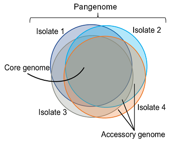
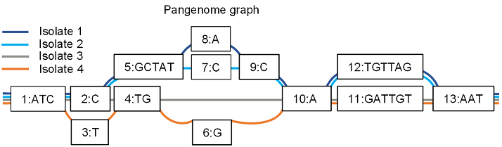
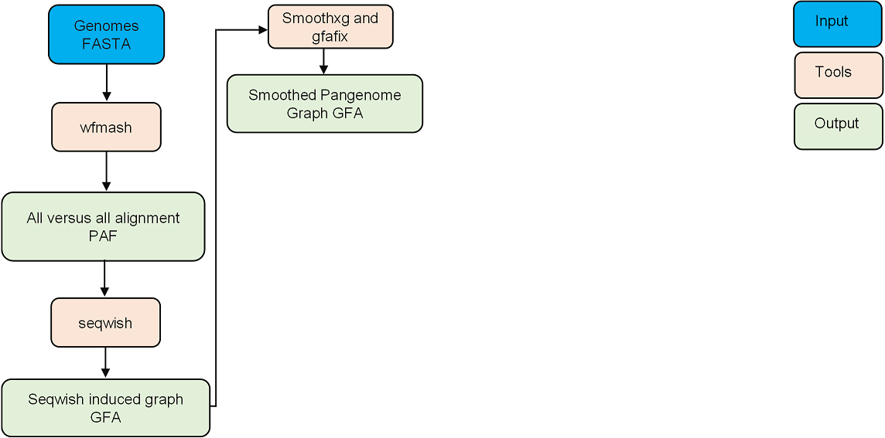
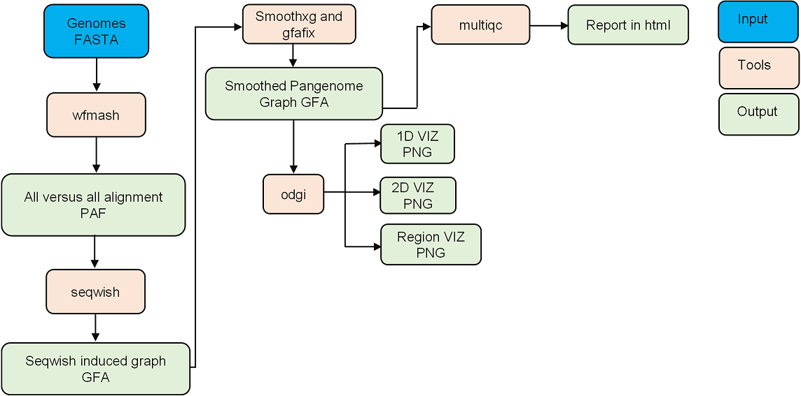
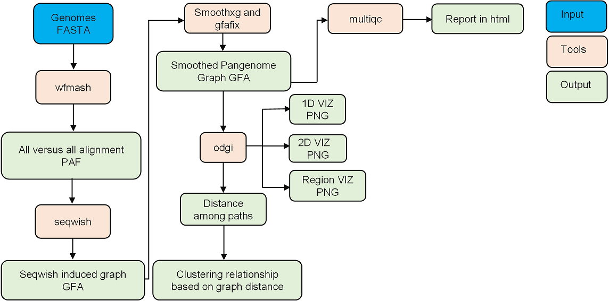
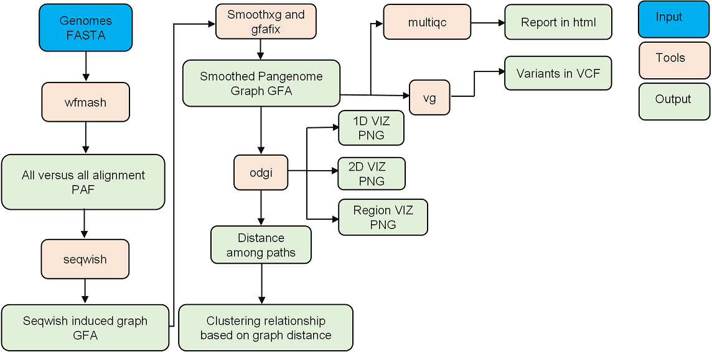
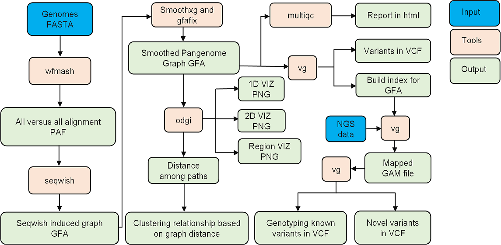

# 1. Introduction to pangenome graphs

## What is a pangenome? 
!!! info ""

A pangenome is defined as the comprehensive collection of whole-genome sequences from multiple individuals within a clade, a population or a species. 

This collective genomic dataset can be further divided into two distinct components: the core genome, which includes regions present in all individuals at the time of analysis, and the accessory genome, consisting of regions only found in a subset of individuals. 

.

## What is a pangenome graph? 
!!! info ""

Pangenome graphs represent pangenomes using graph models, effectively capturing the complete genetic variation across the input genomes. These graphs consist of three components: nodes, edges, and paths.

### **Nodes**
!!! info ""

- DNA segments, which can be any length 

### **Edges** 
!!! info ""

- Describe the possible ways of walking through the nodes
- Connect pairs of node strands
- Can represent inversions 

### **Paths** 
!!! info ""

- Paths are routes through the nodes of the graph
- Genomes
- Haplotypes
- Alleles/variants 

## Overview of a pangenome graph construction pipeline

### **Pangenome concstruction by Pangenome Graph Builder (PGGB)**
!!! info ""

The PGGB pipeline is a reference-free method. It builds pangenome graphs using an all-to-all whole genome alignment approach with wfmash. Seqwish is employed to induce the graph, followed by progressive normalization with smoothxg and gfaffix.

### **graph manipulation using ODGI and multiQC report**
!!! info ""

- The Optimized Dynamic Genome/graph Implementation (ODGI) is used for various graph manipulation tasks, including visualization.
- MultiQC is used to generate a report, which includes statistics of the seqwish-induced graph, the final graph, and various visualizations of the final graph.

### **Obtain distance for phylogenetic analysis**
!!! info ""

We use ODGi to extract distances between paths within the graph, enabling further phylogenetic analysis.

### **Varaint calling**
!!! info ""

By using the pangenome graph created with PGGB, it is possible to concurrently identify a variety of genetic variations. These include structural variations (SVs), rearrangements, and smaller variants such as single nucleotide polymorphisms (SNPs) and insertions/deletions. These can be identified through the process of vg deconstruction.

### **NGS data analysis against graph**
!!! info ""

The VG toolkit is utilized for NGS data analysis against the graph, including tasks such as read mapping and variant calling

## Key components of this pipeline
!!! info ""

-  Graph construction using the PGGB
-  Graph manipulation using ODGI
-  Variant calling for NGS data using the VG toolkit 

It provides an efficient and integrated approach for pangenome analysis. 

