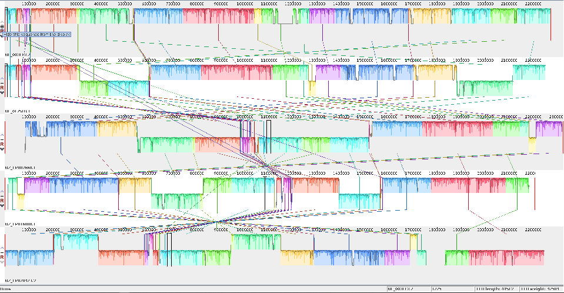
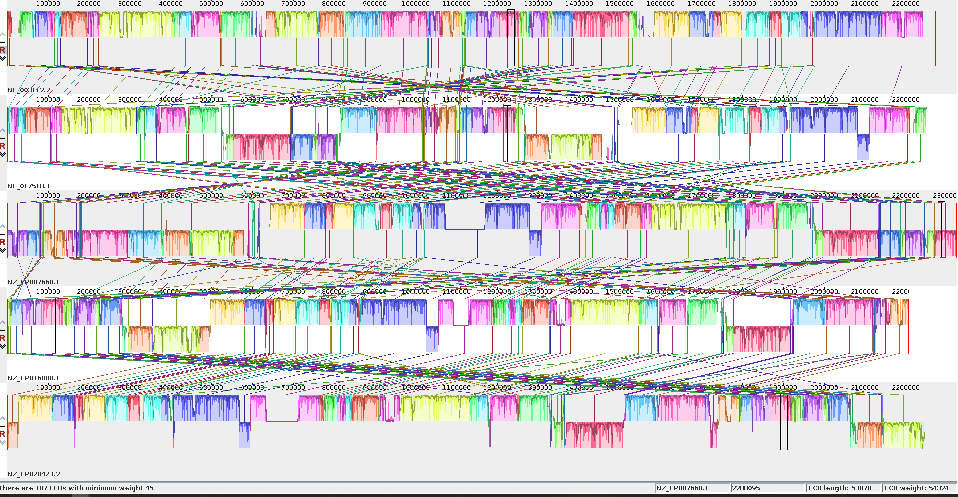
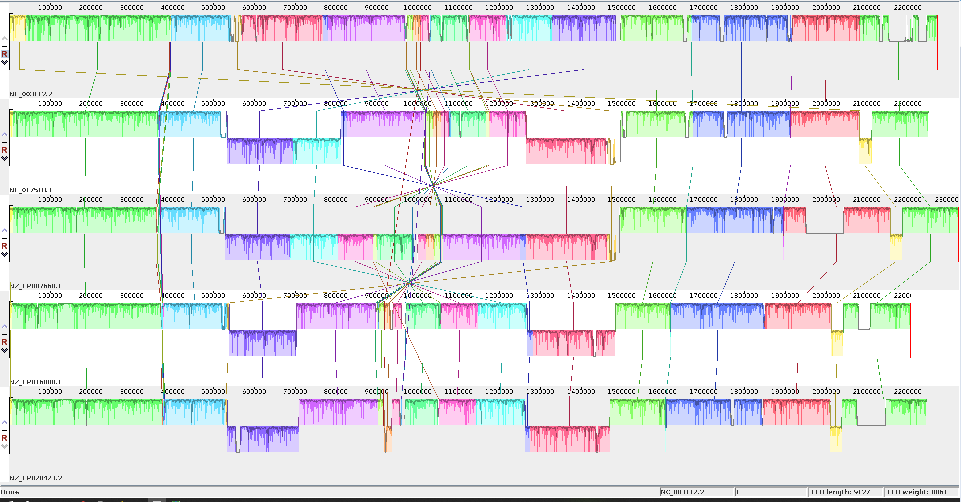

# 2. Tools & setup

!!! screwdriver-wrench "Tools used for the pangenome graph pipeline"
    - The PanGenome Graph Builder (PGGB) is used for graph construction (https://github.com/pangenome/pggb).
    - The Optimized Dynamic Genome/Graph Implementation (ODGI) is employed for graph manipulation (https://github.com/pangenome/odgi).
    - The VG Toolkit is utilized for variant calling with NGS against a pangenome graph reference (https://github.com/vgteam/vg).
    - Mash is used to estimate pairwise distances among genomes (https://github.com/marbl/Mash).
    - ProgressiveMauve is utilized to verify the alignment of genomes (https://darlinglab.org/mauve/user-guide/progressivemauve.html)
    - Circlator is employed to fix the starting point of genomes (https://sanger-pathogens.github.io/circlator/).
    - SAMtools is used to build an index of input FASTA files (https://github.com/samtools/samtools).
    - BCFtools is used to check the statistics of VCF files (https://github.com/samtools/bcftools).

??? info "Other Tools might be useful for pangenome graphs"

    - The Minigraph-Cactus Pangenome Pipeline (https://github.com/ComparativeGenomicsToolkit/cactus/blob/master/doc/pangenome.md).
    - gfaestus, which can be used for graph visualization (https://github.com/chfi/gfaestus)
    - SequenceTubeMap for tube map visualization of genomic sequence graphs (https://github.com/vgteam/sequenceTubeMap)
    - ......


!!! info "Running the pggb pipeline on NeSI"

    PGGB, ODGi, VG, circulator, Mash, SAMTools et.al. have been installed as modules on NeSI. We need to load each module for use. However, please don't load the modules right now; we will load each one when necessary. 
    ```bash
    module load pggb/0.5.3-Miniconda3
    module load SAMtools
    module load Mash/2.3-GCC-11.3.0
    module load Circlator/1.5.5-gimkl-2022a-Python-3.10.5
    module load vg/1.46.0
    ```

??? info "Running the pggb workflow locally"

    The following code **DOES NOT** need to be run if you working on NeSI, but is 
    provided here to show how to work through the workshop material on a non-NeSI 
    system (e.g., if you are running the code on your own computer).

    ### Obtaining pggb
    From https://github.com/pangenome/pggb, you can find the details about installing pggb with Docker, Singularity, bioconda, guix, or by manually building its dependencies.
    
    ### Using pggb via Singularity
    Many managed HPCs utilize Singularity as a secure alternative to docker. Fortunately, docker images can be run through Singularity seamlessly.
    First pull the docker file and create a Singularity SIF image from the dockerfile. This might take a few minutes.
    ```bash
    singularity pull docker://ghcr.io/pangenome/pggb:latest
    ```
    Next clone the pggb repo and cd into it
    ```bash
    git clone --recursive https://github.com/pangenome/pggb.git
    cd pggb
    ```
    Finally, run pggb from the Singularity image. For Singularity to be able to read and write files to a directory on the host operating system, we need to 'bind' that directory using the -B option and pass the pggb command as an argument.
    ```bash
    singularity run -B ${PWD}/data:/data ../pggb_latest.sif pggb -i /data/HLA/DRB1-3123.fa.gz -p 70 -s 3000 -G 2000 -n 10 -t 16 -v -V 'gi|568815561:#' -o /data/out -M -m
    ```

!!! info ""

    ### *Neisseria meningitidis* data set
    
    In this workshop, we use the bacterium _Neisseria (N.) meningitidis_ as our model organism.
 - Bacteria called _N. meningitidis_ cause meningococcal disease(IMD). About 1 in 10 people have these bacteria in the back of their nose and throat without being ill. This is called being ‘a carrier.’ Sometimes the bacteria invade the body and cause IMD.
 - Different capsular polysaccharides divide the meningococci into at least 12 serogroups, of which six groups (A, B, C, W, X, and Y) are responsible for most disease.
 - The genome of this bacterium spans approximately 2.1 to 2.4 Mb and possesses a GC content ranging from 51-52%.
 - A notable trait of _N. meningitidis_ genomes is their high recombination rate, which contributes significantly to the substantial genetic diversity found in this species.
 - Throughout this workshop, we use five genome assemblies of _N. meningitidis_ to evaluate the pangenome pipeline, from the construction of the pangenome graph to the calling of variants.


| genomes                             | ASM IDs   |GCF IDs    | SEROGROUP  | Sequence type | Clonal Complex   |
|:-----                               |----------:|----------:|-----------:|--------------:|-----------------:|
|NC_017518.1 Neisseria meningitidis NZ-05/33	| ASM19152v1	|GCF_000191525.1	|B	|42	|ST-41/44	|
|NC_003112.2 Neisseria meningitidis MC58    	| ASM880v1	|GCF_000008805.1 	|-	|74	|ST-32	|
|NZ_CP007668.1 Neisseria meningitidis M0579  	| ASM102983v1|GCF_001029835.1		|B	|-	|ST-41/44	|
|NZ_CP016880.1 Neisseria meningitidis strain M07165	| ASM170367v1	|GCF_001703675.1	|W	|11	|ST-11	|
|NZ_CP020423.2 Neisseria meningitidis strain FDAARGOS_212	| ASM207367v2	|GCF_002073675.2	|C	|-	|ST16521	|


??? circle-info "How the *Neisseria meningitidis* genomes were formatted for this workshop"

    The following code **DOES NOT** need to be run, but is provided here to show how the *Neisseria meningitidis* genomes
    were downloaded and prepared for analysis.
    
    ```bash
    # Create a new directory called nm_genomes and change to that directory
    mkdir nm_genomes
    cd nm_genomes
    ```
    
    Download the genome assemblies from NCBI and uncompress.  In the Unix environment you can use the `curl` command.

    ```bash
    #NC_017518.1
    curl -OJX GET "https://api.ncbi.nlm.nih.gov/datasets/v2alpha/genome/accession/GCF_000191525.1/download?include_annotation_type=GENOME_FASTA,GENOME_GFF,RNA_FASTA,CDS_FASTA,PROT_FASTA,SEQUENCE_REPORT&filename=GCF_000191525.1.zip" -H "Accept: application/zip"

    # ACC NUM?
    curl -OJX GET "https://api.ncbi.nlm.nih.gov/datasets/v2alpha/genome/accession/GCF_001029835.1/download?include_annotation_type=GENOME_FASTA,GENOME_GFF,RNA_FASTA,CDS_FASTA,PROT_FASTA,SEQUENCE_REPORT&filename=GCF_001029835.1.zip" -H "Accept: application/zip"

    # ACC NUM?
    curl -OJX GET "https://api.ncbi.nlm.nih.gov/datasets/v2alpha/genome/accession/GCF_001703675.1/download?include_annotation_type=GENOME_FASTA,GENOME_GFF,RNA_FASTA,CDS_FASTA,PROT_FASTA,SEQUENCE_REPORT&filename=GCF_001703675.1.zip" -H "Accept: application/zip"

    # ACC NUM?
    curl -OJX GET "https://api.ncbi.nlm.nih.gov/datasets/v2alpha/genome/accession/GCF_002073675.2/download?include_annotation_type=GENOME_FASTA,GENOME_GFF,RNA_FASTA,CDS_FASTA,PROT_FASTA,SEQUENCE_REPORT&filename=GCF_002073675.2.zip" -H "Accept: application/zip"

    # ACC NUM?
    curl -OJX GET "https://api.ncbi.nlm.nih.gov/datasets/v2alpha/genome/accession/GCF_000008805.1/download?include_annotation_type=GENOME_FASTA,GENOME_GFF,RNA_FASTA,CDS_FASTA,PROT_FASTA,SEQUENCE_REPORT&filename=GCF_000008805.1.zip" -H "Accept: application/zip"
    ```

    On NeSI, a slurm job can be run to process the .fna genomes.  The contents of the slurm job file (`unzip_genomes.sl`) 
    are as follows: 

    ```bash linenums="1"
    #!/bin/bash -e

    #SBATCH --account       nesi02659
    #SBATCH --job-name      extract_fna
    #SBATCH --cpus-per-task 8
    #SBATCH --mem           4G
    #SBATCH --time          1:00:00

    data=$HOME/nm_genomes/*.zip

    for f in $data
    do
        x=$(basename $f .zip)
        echo ${x}

        unzip $x.zip

        cp $HOME/nm_genomes/ncbi_dataset/data/${x}/*_genomic.fna /$HOME/nm_genomes/

        rm -rf ncbi_dataset
    done
    ```

    The slurm job can be run via:

    ```
    sbatch unzip_genomes.sl
    ```

    Remove unneeded files:
    
    ```bash
    rm cds_from_genomic.fna
    rm *.zip
    rm README.md
    rm slurm*.out
    ```

    Use the `cat` command to combine genomes into a single fasta file:

    ```
    cat *_genomic.fna > 5NM.fa
    ```


??? screwdriver-wrench "Fix the start point of the input genomes?"

    #### Circlator

    Bacterial genomes are typically circular, so establishing a fixed starting point for each input genome during pangenome graph construction could reduce unnecessary complexity within the graph. Once the genomes are aligned with the same starting point, we can build their index using samtools faidx and proceed with constructing the pangenome graph. I encourage you to experiment with this approach after this workshop to see how effectively it functions. Please note that it may be necessary to try different regions as a starting point to ensure that all genomes are fixed with the same initial region.

    let's fix the start for all genome using circlator, submit a slurm job. It takes less than one minute for each sample. 

    ```bash linenums="1"
    #!/bin/bash -e 

    #SBATCH --account       nesi02659
    #SBATCH --job-name      restart_fna
    #SBATCH --cpus-per-task 8
    #SBATCH --mem           4G
    #SBATCH --time          1:00:00

    module load Circlator/1.5.5-gimkl-2022a-Python-3.10.5

    cd /home/zyang/pg_test
    data=/home/zyang/pg_test/*.fna
    
    #For some dataset, we may have to try different start point to make sure all genomes being fixed with the same region. 
    start_region=start_region.fa
    
    
    for f in $data
    do

    x=$(basename $f .fna)
    echo ${x}
    
    circlator fixstart --genes_fa  start_region  ${x}.fna  ${x}.restart

    done
    ```
   
    Use the `cat` command to combine genomes into a single fasta file:

    ```
    cat *_genomic.restart.fasta > 5NMfs.fa
    ```


??? screwdriver-wrench "Fix the start point of the 5NM genomes"

    **One tricky aspect is finding a region that is present in all the genomes and is oriented in the same direction**
    The mauve alignment of the 5NM genomes 
    

    The Mauve alignment after attempting to fix the start point using the first 50 lines of genome one. 
    

    The Mauve alignment after fixing the start point using the first 50 lines of the second genome, which has been aligned with the first 50 lines of genome one.
    


### Setting up your project directory and downloading the dataset

!!! terminal "code"

    ```bash
    # Create a new directory under your home folder and change to that directory.
    # This will be your "working directory" for the workshop.
    mkdir ~/pg_workshop
    cd ~/pg_workshop
    # Keep a note of the absolute path of your working directory
    pwd
    ```
    !!! success "Output"

        ```
        /home/<YOUR_USER_ID>/pg_workshop
        ```
    
    ```bash
    # To be simply, we have renamed the 5NMfs.fa to 5NM.fa for this workshop. Please download the dataset.  
    
    git clone https://github.com/ZoeYang2020/dataset_for_pg_workshop
    
    # Copy the 5NM.fa and  dataset to your working directory
    cp $PWD/dataset_for_pg_workshop/5NM.fa
    ```
