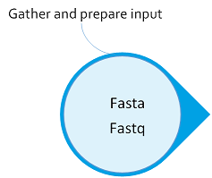
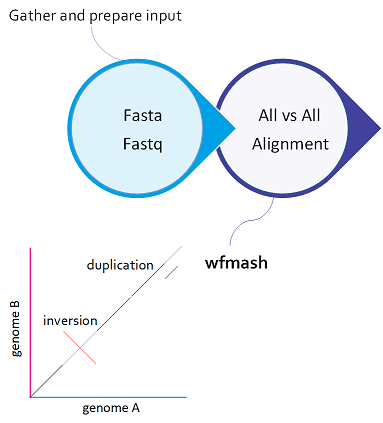
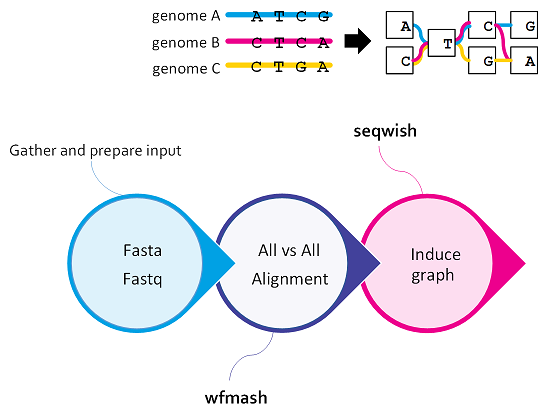
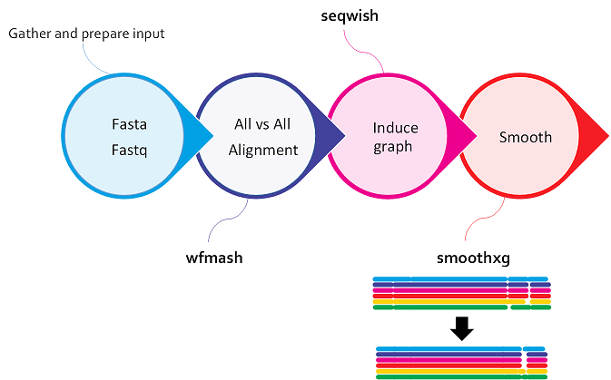
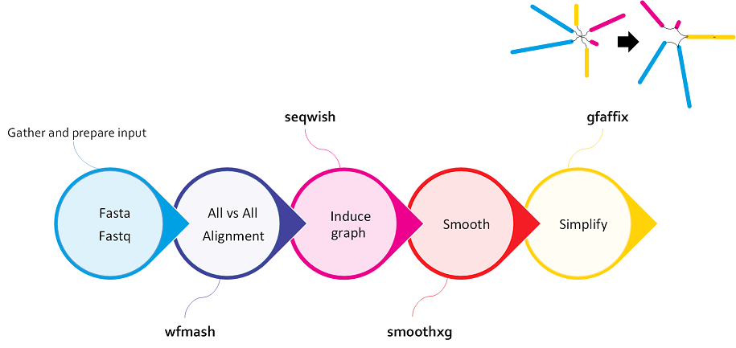
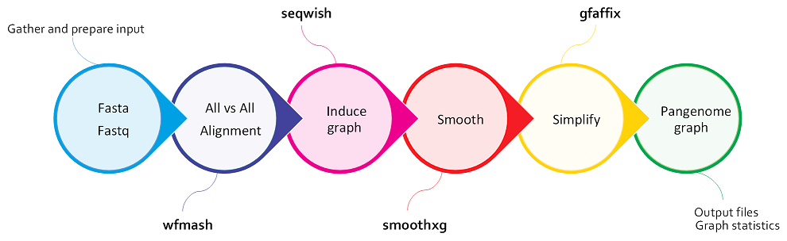
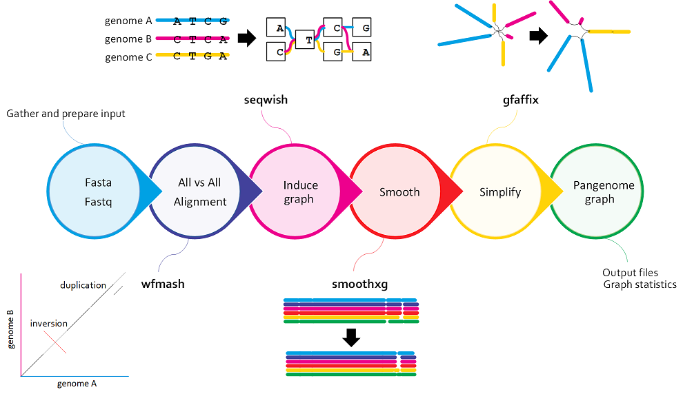

# 3. PGGB overview

A pangenome variation graph is a kind of generic multiple sequence alignment. It lets us understand any kind of sequence variation between a collection of genomes. It shows us similarity where genomes walk through the same parts of the graph, and differences where they do not.
    
PanGenome Graph Builder (PGGB) constructs a pan-genome graph, which is a data structure that represents the entire set of genes and genetic variations in a population.
PGGB builds pangenome graphs from a set of input sequences unbiasly. The main novelty of PGGB is not simply the reference independence, but moreover its ability to capture all parts of input genomes losslessly. 

This graph can be used to study genetic diversity, gene function, and evolution. PGGB is designed to be scalable and efficient, making it suitable for large-scale genomic analyses. It is an open-source tool that can be used freely by researchers in the field of genomics.

### How does PGGB work?

PGGB generates graphs using an all-to-all alignment of input sequences (wfmash), graph induction (seqwish), and progressive normalization (smoothxg, gfaffix). After construction, PGGB generates diagnostic visualizations of the graph (odgi). A variant call report (in VCF) representing both small and large variants can be generated based on any reference genome included in the graph (vg). PGGB writes its output in GFAv1 format, which can be used as input by numerous "genome graph" and pangenome tools, such as the vg and odgi toolkits.-Scale Graph Construction: The PGGB algorithm is designed to handle large-scale genomes and can efficiently construct genome graphs containing extensive genetic variations.

#### input fasta file 

#### All-to-all alignment

Generally, refers to the process of aligning all sequences in a given set against each other, rather than aligning them to a single reference sequence.
We begin with an alignment with `wfmash`. This compares all sequences to each other and finds the best N mappings for each. It produces base-level alignments.

#### Inducing the graph

Refers to the process of constructing the genome graph by progressively integrating genetic variants into a reference genome.
These base-level alignments are converted into a graph with `seqwish`. A filter is applied to remove short matches, which anchors the graph on confident longer exact matches.

#### Normalizing the graph by SMOOTHXG and GFAFix
This process aims to optimize the structure and representation of the genome graph by resolving redundant or overlapping elements. This step is typically performed after the initial construction of the graph.

##### SMOOTHXG
Through a series of passes over the pangenome, SMOOTHXG reshapes the graph to reduce local complexity and underalignment. This resolves key problems encountered in earlier attempts to implement all-vs-all alignment based graph construction, which typically resulted in very complex, looping, graph motifs at small scales, and redundancy caused by match filtering.
The normalization process in PGGB involves several steps, which may vary depending on the specific implementation or version of the tool. Here are some common steps involved in normalizing the graph:  
1.  Removal of Redundant Nodes: During the construction of the genome graph, it is possible that some nodes become redundant due to overlapping or repetitive sequences. Normalization involves identifying and removing these redundant nodes, streamlining the graph structure.  
2.	Edge Optimization: Edges represent connections between nodes. During normalization, the edges are optimized to minimize redundancy and improve the efficiency of the graph. This can include merging or repositioning edges to create a more streamlined and accurate representation of the genome.  

##### gfafix 
3.	Compact Representation: Normalization aims to reduce the overall size of the graph by compacting the representation. This can involve compressing repetitive regions or simplifying complex structures while preserving the essential information and variant representation.
4.	Graph Refinement: The normalization process also involves refining the graph structure by resolving inconsistencies, correcting errors, and improving the overall quality of the graph representation. This may include resolving conflicts between nodes and edges, addressing mismatches, and ensuring the graph accurately reflects the underlying genetic variations.

#### Multiqc and graphstatistics 

### PGGB workflow 

### Key parameters

https://github.com/pangenome/pggb6
The overall structure of PGGB's output graph is defined by three parameters: genome number (-n), segment length (-s), and pairwise identity (-p). 

Genome number (-n) is a given, but varies in ways that are difficult to infer and is thus left up to the user. Segment length defines the seed length used by the "MashMap3" homology mapper in wfmash. 

The pairwise identity (-p) is the minimum allowed pairwise identity between seeds, which is estimated using a mash-type approximation based on k-mer Jaccard. Mappings are initiated from collinear chains of around 5 seeds (-l, --block-length), and extended greedily as far as possible, allowing up to -n minus 1 mappings at each query position.

An additional parameter, -k, can also greatly affect graph structure by pruning matches shorter than a given threshold from the initial graph model. In effect, -k N removes any match shorter than Nbp from the initial alignment. This filter removes potentially ambiguous pairwise alignments from consideration in establishing the initial scaffold of the graph.

The initial graph is defined by parameters to wfmash and seqwish. But due to the ambiguities generated across the many pairwise alignments we use as input, this graph can be locally very complex. To regularize it we orchestrate a series of graph transformations. First, with smoothxg, we "smooth" it by locally realigning sequences to each other with a traditional multiple sequence alignment (we specifically apply POA). This process repeats multiple times to smooth over any boundary effects that may occur due to binning errors near MSA boundaries. Finally, we apply gfaffix to remove forks where both alternatives have the same sequence.

### Examples of key parameters for executing PGGB
- Human, whole genome, 90 haplotypes: `pggb -p 98 -s 50k -n 90 -k 79 ...`
- 15 helicobacter genomes, 5% divergence: `pggb -n 15 -k 79, and 15 at higher (10%) divergence pggb -n 15 -k 19 -P asm20 ...`
- Yeast genomes, 5% divergence: PGGB's defaults should work well, just set -n.
- Aligning 9 MHC class II assemblies from vertebrate genomes (5-10% divergence): `pggb -n 9 -k 29 ...`
- A few thousand bacterial genomes `pggb -x auto -n 2146 ...`
    - In general mapping sparsification (`-x auto`) is a good idea when you have many hundreds to thousands of genomes.
- PGGB defaults to using the number of threads as logical processors on the system (the thread count given by getconf _NPROCESSORS_ONLN). Use -t to set an appropriate level of parallelism if you can't use all the processors on your system.

### Other parameters for executing PGGB
-S generate statistics of the seqwish and smoothxg graph

-m generate MultiQC report of graphs' statistics and visualizations, automatically runs odgi stats

-V specify a set of VCFs to produce with SPEC = REF:DELIM[:LEN][,REF:DELIM:[LEN]]* the paths matching ^REF are used as a reference, while the sample haplotype are derived from path names, e.g. when DELIM=# and with '-V chm13:#', a path named HG002#1#ctg would be assigned to sample HG002 phase 1. If LEN is specified and greater than 0, the VCFs are decomposed, filtering sites whose max allele length is greater than LEN. [default: off]

-o, --output-dir PATH       output directory
