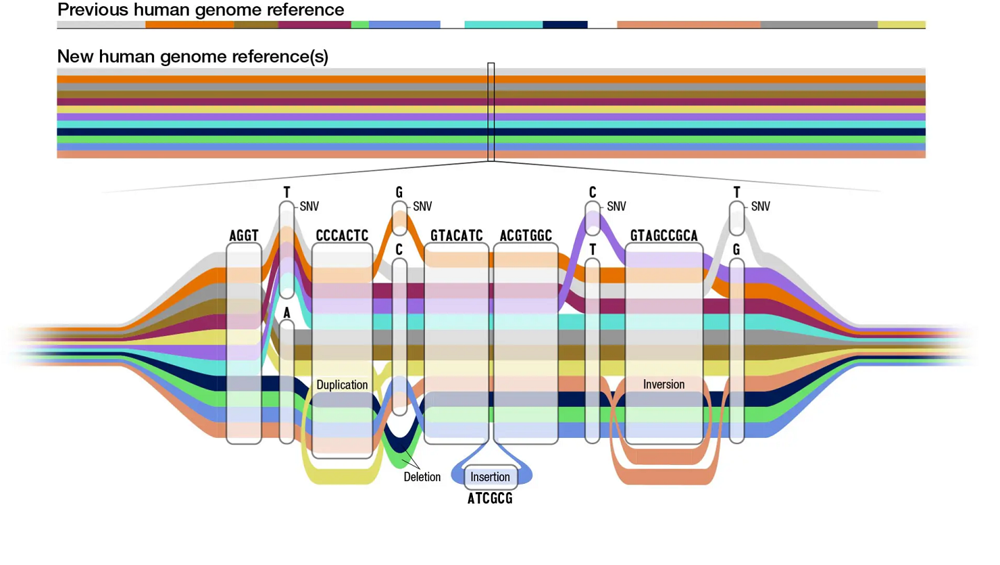

# 3. Introduction to PGGB

## Variation graph and PGGB 
!!! info ""

https://www.bioworld.com/articles/696850-pangenome-gives-more-panoramic-view-of-human-diversity?v=preview

- Variation graphs provide a compact representation of genetic variation across a population in the form of bidirected DNA sequence graphs, and they can encompass large-scale structural variants (SVs) such as inversions and duplications.

- PGGB, the the PanGenome Graph Builder, is a reference-free pangenome graph constuction method. PGGB builds pangenome graphs from a set of input sequences.

- The main novelty of PGGB  is not just that it doesn't rely on a reference, but more importantly, it can accurately and fully capture every part of the input genomes.

## How does PGGB work?
!!! info ""

- **PGGB** generates graphs using an all-to-all alignment of input sequences (`wfmash`), graph induction (`seqwish`), and progressive normalization (`smoothxg`, `gfaffix`).

- **Scalable  Graph Construction**: The PGGB algorithm is designed to handle large-scale genomes and can efficiently construct genome graphs containing extensive genetic variations.
  
- After construction, PGGB generates diagnostic visualizations of the graph (`odgi`).

- PGGB writes its output in **GFAv1(.gfa)** format, which can be used as input by numerous "genome graph" and pangenome tools, such as the vg and odgi toolkits. **.gfa file is the new data structure for graph references**

- A variant call report (in Variant Call Format - VCF) representing both small and large variants can be generated **based on any reference genome** included in the graph.

### Input fasta file 
!!! info ""

### All-to-all alignment
!!! info ""

**All-to-all alignment** refers to the process of aligning all sequences in a given set against each other, rather than aligning them to a single reference sequence.
PGGB begins with an alignment using `wfmash` to align the input genomes. This compares all sequences to each other and finds the best `N` mappings for each. It produces base-level alignments.

### Inducing the graph
!!! info ""

**Graph induction** refers to the process of constructing the genome graph by progressively integrating genetic variants into a reference genome.
These base-level alignments are converted into a graph with `seqwish`. A filter is applied to remove short matches, which anchors the graph on confident longer exact matches.

### Normalizing the graph with smoothxg and gfafix
!!! info ""

This process aims to optimize the structure and representation of the genome graph by resolving redundant or overlapping elements. This step is typically performed after the initial construction of the graph.

#### smoothxg
!!! info ""

Through a series of passes over the pangenome, `smoothxg` reshapes the graph to reduce local complexity and underalignment. This resolves key problems encountered in earlier attempts to implement all-vs-all alignment based graph construction, which typically resulted in very complex, looping, graph motifs at small scales, and redundancy caused by match filtering.
The normalization process in PGGB involves several steps, which may vary depending on the specific implementation or version of the tool. Here are some common steps involved in normalizing the graph:  
1.  **Removal of Redundant Nodes**: During the construction of the genome graph, it is possible that some nodes become redundant due to overlapping or repetitive sequences. Normalization involves identifying and removing these redundant nodes, streamlining the graph structure.  
2.	**Edge Optimization**: Edges represent connections between nodes. During normalization, the edges are optimized to minimize redundancy and improve the efficiency of the graph. This can include merging or repositioning edges to create a more streamlined and accurate representation of the genome.  

#### gfafix
!!! info ""

3.	**Compact Representation**: Normalization aims to reduce the overall size of the graph by compacting the representation. This can involve compressing repetitive regions or simplifying complex structures while preserving the essential information and variant representation.
4.	**Graph Refinement**: The normalization process also involves refining the graph structure by resolving inconsistencies, correcting errors, and improving the overall quality of the graph representation. This may include resolving conflicts between nodes and edges, addressing mismatches, and ensuring the graph accurately reflects the underlying genetic variations.

### MultiQC and graph statistics
!!! info ""

## PGGB workflow
!!! info ""

### Key parameters
!!! info ""

The overall structure of PGGB's output graph is defined by three parameters: genome number (`-n`), segment length (`-s`), and pairwise identity (`-p`). 

- `-n` : Genome number.
- `-s` : Segment length defines the seed length used by the "MashMap3" homology mapper in wfmash.
- `-p` : The pairwise identity (-p) is the minimum allowed pairwise identity between seeds. **default, 90**

- `-k` : An additional parameter, can also greatly affect graph structure by pruning matches shorter than a given threshold from the initial graph model. In effect, **-k N removes any match shorter than Nbp** from the initial alignment. This filter removes potentially ambiguous pairwise alignments from consideration in establishing the initial scaffold of the graph. **default 19**

### Other parameters for executing PGGB
!!! info ""

- `-S` : Generate statistics of the seqwish and smoothxg graph

- `-m` : Generates MultiQC report of graphs' statistics and visualizations, automatically runs odgi stats

- `-V` : Specify a path to generate a VCF from the graph. 

- `-o`, `--output-dir PATH` : Output directory

### Examples of key parameters for executing PGGB
!!! info ""

- Human, whole genome, 90 haplotypes: `pggb -p 98 -s 50k -n 90 -k 79 ...`
- 15 helicobacter genomes, 5% divergence: `pggb -p 90 -n 15 -k 79 ....`
- Yeast genomes, 5% divergence: PGGB's defaults should work well, just set -n.
- Aligning 9 Major Histocompatibility Complex (MHC) class II assemblies from vertebrate genomes (5-10% divergence): `pggb -p 90 -n 9 -k 29 ...`
- A few thousand bacterial genomes `pggb -x auto -n 2146 ...`. In general mapping sparsification **(`-x auto`)** is a good idea when you have many hundreds to thousands of genomes.

