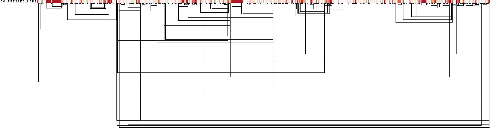
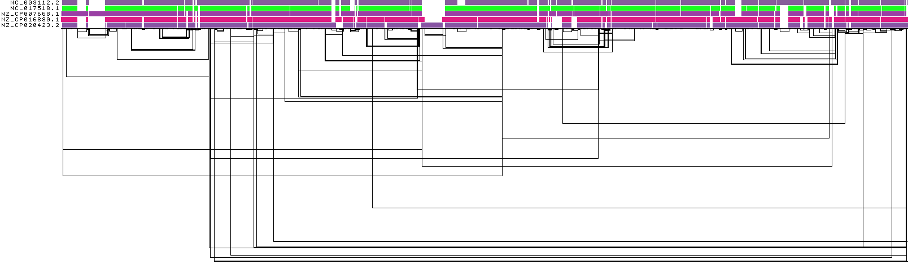
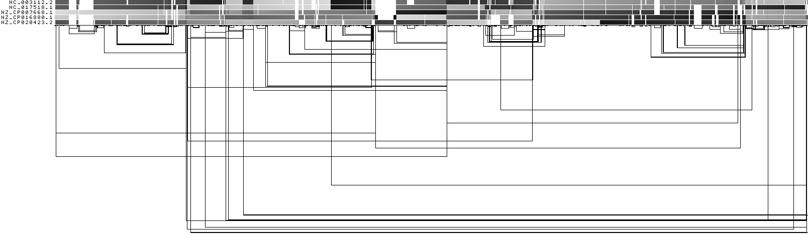
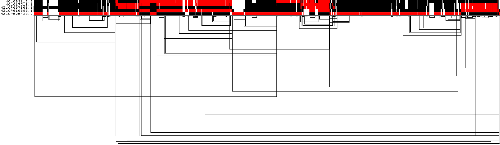
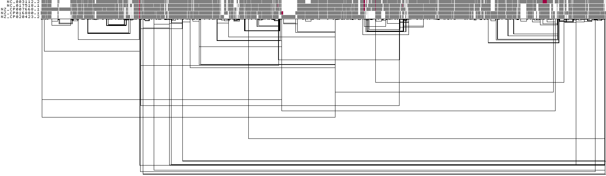
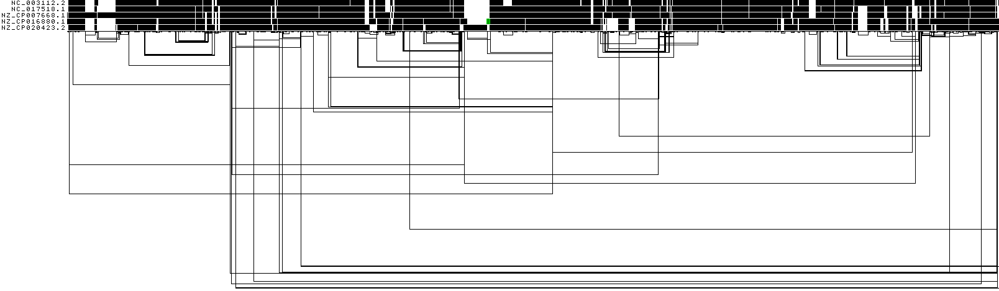
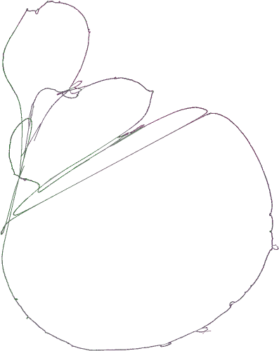
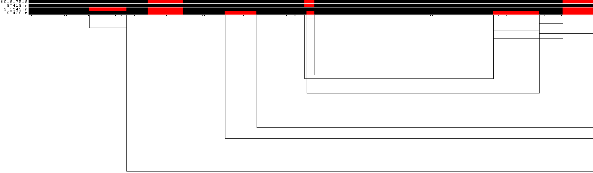
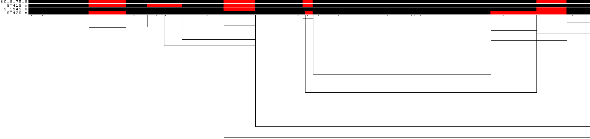
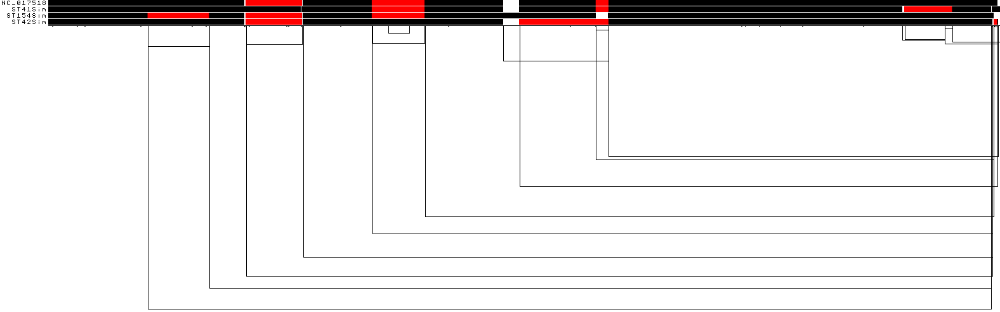

# 5. Evaluating output
When we ran PGGB, the 'odgi stats -S' option was utilized to generate statistics for both the seqwish and smoothxg graphs and the 'multiqc -m' option was employed to generate a MultiQC report, providing comprehensive statistics and visualizations of the graphs. All pertinent results can be located in the MultiQC report, which is saved in HTML format.


## Pangenome graph visualization using ODGI 

### ODGI Compressed 1D visualization
This image shows a 1D rendering of the built pangenome graph. The graph nodes are arranged from left to right, forming the pangenome sequence. Summarization of path coverage across all paths. Dark blue means highest coverage. Dark red means lowest coverage. The path names are placed on the left. The black lines under the paths are the links, which represent the graph topology.



### ODGI 1D visualization
This image shows a 1D rendering of the built pangenome graph. The graph nodes are arranged from left to right, forming the pangenome sequence. The colored bars represent the paths versus the pangenome sequence in a binary matrix. The path names are placed on the left. The black lines under the paths are the links, which represent the graph topology.




### ODGI 1D visualization by path position
This shows a 1D rendering of the built pangenome graph where the paths are colored according to their nucleotide position. Light grey means a low path position, black is the highest path position.




### ODGI 1D visualization by path orientation
This image shows a 1D rendering of the built pangenome graph where the paths are colored by orientation. Forward is black, reverse is red.




??? info "What happened for the last path compared to the rest paths"
    #### The orientation of the last path is almost exacetly reverse as the second last, right? Do you think is it possible that the last path of genome was submitted as its a 
    reverse complement? 


### ODGI 1D visualization by node depth



### ODGI 1D visualization by uncalled bases



### ODGI 2D drawing



### Evaluate Pangenome Graphs for 4Sim Genomes Constructed with Different Settings
- We have employed three distinct settings to construct the pangenome graph of the 4Sim genomes. Which setting yielded the most optimal result? How can we determine this? 

- Download the multiqc.html file, check the Detailed ODGI stats table.
#### 1k96
| Sample Name                         | Length    | Nodes  | Edges  | Components | A   |C    |T    |G    |N   |
|:-----                               |----------:|-------:|-------:|-----------:|----:|----:|----:|----:|----:|
|seqwish	|2280344	|22216	|29823	|4	|1	|551639	|578590	|557450	|592665	|0|
|smooth	|2261163	|29965	|40179	|4	|1	|548754	|574693	|551650	|586066	|0|




#### 1k96,-K79


| Sample Name                         | Length    | Nodes  | Edges  | Components | A   |C    |T    |G    |N   |
|:-----                               |----------:|-------:|-------:|-----------:|----:|----:|----:|----:|----:|
|seqwish	|2279905	|22209	|29812	|4	|1	|551588	|578459	|557291	|592567	|0|
|smooth	|2261401	|29976	|40199	|4	|1	|553049	|580469	|547460	|580423	|0|




#### 10k96
| Sample Name                         | Length    | Nodes  | Edges  | Components | A   |C    |T    |G    |N   |
|:-----                               |----------:|-------:|-------:|-----------:|----:|----:|----:|----:|----:|
|seqwish	|2340700	|22166	|29759	|4	|1	|566559	|594741	|571836	|607564	|0|
|smooth	|2319601	|29888	|40070	|4	|1	|566755	|599287	|562078	|591481	|0|



## Circlator

**NB: this material below was moved from Section 2. Motivate this stuff by inspecting the 1D graph of inversions, and
note that one of the samples is completely inverted relative to the others.**

!!! question "Exercises"

    - Can we cat the graph and start pangenome graph construction now? 
    - What potiential issues could there be? 
    - We need to check whether all the genomes are with the same start. If not, it will cause unwanted complexsity for the pangenome graph. 
    
```bash
head -10 *.fna >>head10_check
less -S head10_check
```
let's fix the start for all genome using circlator, submit a slurm job. It takes less than one minute for each sample. 
```bash
#!/usr/bin/bash

#SBATCH --account       ga03793
#SBATCH --job-name      restart_fna
#SBATCH --cpus-per-task 8
#SBATCH --mem           4G
#SBATCH --time          1:00:00

module load Circlator/1.5.5-gimkl-2022a-Python-3.10.5

cd /home/zyang/pg_test
data=/home/zyang/pg_test/*.fna

for f in $data
do

x=$(basename $f .fna)
echo ${x}

circlator fixstart  ${x}.fna  ${x}.restart

done
```

