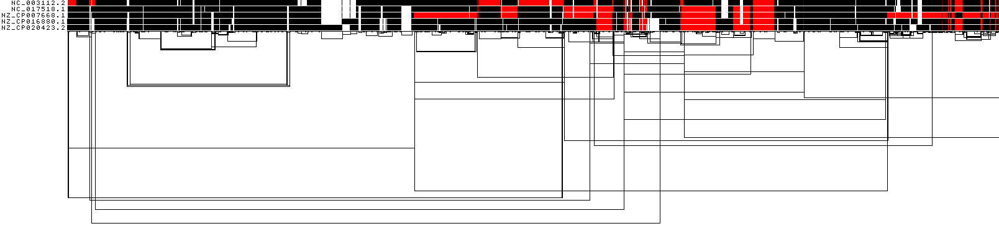

# 5. Evaluating output
- When we ran PGGB, the 'odgi stats -S' option was utilized to generate statistics for both the seqwish and smoothxg graphs and the 'multiqc -m' option was employed to generate a MultiQC report, providing comprehensive statistics and visualizations of the graphs. All pertinent results can be located in the MultiQC report, which is saved in HTML format.
- The output folder contains all the PGGB-related results, including the .smooth.final.og and all associated visualization figures. It also includes .final.smooth.gfa (a Graphical Fragment Assembly file), as well as variations of the graph presented in a VCF (Variant Call Format) file

## check the files 
!!! terminal "code"

    ```bash
    
    cd  ~/pg_workshop/5NM_2K94
    
    ls  
    ```
    ??? success "Output"
        ```bash 
        5NM.fa.37e9cb5.417fcdf.e2ae00b.smooth.06-20-2023_01:31:34.log
        5NM.fa.37e9cb5.417fcdf.e2ae00b.smooth.06-20-2023_01:31:34.params.yml
        5NM.fa.37e9cb5.417fcdf.e2ae00b.smooth.final.gfa
        5NM.fa.37e9cb5.417fcdf.e2ae00b.smooth.final.NC_017518.1.vcf
        5NM.fa.37e9cb5.417fcdf.e2ae00b.smooth.final.NC_017518.1.vcf.stats
        5NM.fa.37e9cb5.417fcdf.e2ae00b.smooth.final.og
        5NM.fa.37e9cb5.417fcdf.e2ae00b.smooth.final.og.lay
        5NM.fa.37e9cb5.417fcdf.e2ae00b.smooth.final.og.lay.draw_multiqc.png
        5NM.fa.37e9cb5.417fcdf.e2ae00b.smooth.final.og.lay.draw.png
        5NM.fa.37e9cb5.417fcdf.e2ae00b.smooth.final.og.lay.tsv
        5NM.fa.37e9cb5.417fcdf.e2ae00b.smooth.final.og.stats.yaml
        5NM.fa.37e9cb5.417fcdf.e2ae00b.smooth.final.og.viz_depth_multiqc.png
        5NM.fa.37e9cb5.417fcdf.e2ae00b.smooth.final.og.viz_inv_multiqc.png
        5NM.fa.37e9cb5.417fcdf.e2ae00b.smooth.final.og.viz_multiqc.png
        5NM.fa.37e9cb5.417fcdf.e2ae00b.smooth.final.og.viz_O_multiqc.png
        5NM.fa.37e9cb5.417fcdf.e2ae00b.smooth.final.og.viz_pos_multiqc.png
        5NM.fa.37e9cb5.417fcdf.e2ae00b.smooth.final.og.viz_uncalled_multiqc.png
        5NM.fa.37e9cb5.417fcdf.e2ae00b.smooth.fix.affixes.tsv.gz
        5NM.fa.37e9cb5.417fcdf.seqwish.og.stats.yaml
        5NM.fa.37e9cb5.alignments.wfmash.paf
        multiqc_config.yaml
        multiqc_data
        multiqc_report.html
        ```

## check the .gfa file. 
- (Graphical Fragment Assembly) GFA is a file format commonly used to represent assembly graphs or sequence variation graphs

!!! terminal "code"

    ```bash
    
    head 5NM*.gfa |less -S 
    ```
    ??? success "Output"
        ```bash 
        H       VN:Z:1.0
        S       1       ATCCGCCCGACCAAGAAGGCATTTTGGAACTACACATCCGCAGGCGCAAAAACGGTGTCTGCTCGGAAATGATTTTCGGCAGCGAACCCAAAGTCAAAGAAAAAGGCATCGTCCG
        L       1       +       4       +       0M
        S       2       CGAAATTGTTTCTTTGTCCGTTTGCGATGTTTTTTAGCTTTGGGGCAGTCGAGAATCACGCCGCTCGTTCGGCTTGTGTAACTGATGTTTTTATGCCCCCTTATCTAACAGGGGG
        L       2       +       133478  +       0M
        S       3       TCCATTGGGGCAAGGCCGCCGCGCCGACCGGTTTGGCTTCCCACACTTCCCCCTTTGCCGCCAATGCGGCAAACCATTTGGACTGGAGCTGGGTTTTCTCCAGTTTGGGCAGCAA
        L       3       +       175915  +       0M
        S       4       G
        L       4       +       5       +       0M
        S       5       CCATCGGACGCTTGGACATCAACACCAGCGGACTTCTGATTCT
        ```
    ```bash
    
    tail 5NM*.gfa |less -S 
    ```
    ??? success "output"
        ```bash 
        S       246216  G
        L       246216  +       246135  +       0M
        L       246216  +       246217  +       0M
        S       246217  GAC
        L       246217  +       246136  +       0M
        P       NC_003112.2     85316+,85318+,85319+,85321+,85322+,85323+,85325+,85327+,85328+,85330+,85331+,85333+,85334+,85336+,85337+,85
        P       NC_017518.1     85316+,85317+,85319+,85320+,85322+,85323+,85325+,85326+,85328+,85329+,85331+,85332+,85334+,85335+,85337+,85
        P       NZ_CP007668.1   1+,4+,5+,6+,8+,9+,11+,12+,14+,15+,17+,18+,20+,21+,23+,25+,26+,27+,29+,31+,32+,34+,35+,37+,38+,39+,41+,43+,4
        P       NZ_CP016880.1   2+,133478+,133479+,133481+,133482+,133483+,133485+,133486+,133488+,133489+,133490+,133492+,133493+,133495+,
        P       NZ_CP020423.2   3+,175915+,175916+,175918+,175919+,175921+,175922+,175924+,175925+,175926+,175928+,175929+,175931+,175932+,
        ```
    ??? success "what does S, L, P mean"
    **S means DNA segments, L means links between notes, and P means paths**


## Pangenome graph visualization using ODGI 

### ODGI Compressed 1D visualization
!!! info ""
  


This image shows a 1D rendering of the built pangenome graph. The graph nodes are arranged from left to right, forming the pangenome sequence. Summarization of path coverage across all paths. Dark blue means highest coverage. Dark red means lowest coverage. The path names are placed on the left. The black lines under the paths are the links, which represent the graph topology.

!!! terminal "code"

    ```bash
    #ODGI Compressed 1D visualization 
    odgi viz -i ./5NM.fa.44bbb23.417fcdf.74b0801.smooth.final.og -o ./5NM.fa.44bbb23.417fcdf.74b0801.smooth.final.og.viz_O_multiqc_1.png -x 1500 -y 500 -a 10 -O -I Consensus_  
    ```


### ODGI 1D visualization
!!! info ""
 


This image shows a 1D rendering of the built pangenome graph. The graph nodes are arranged from left to right, forming the pangenome sequence. The colored bars represent the paths versus the pangenome sequence in a binary matrix. The path names are placed on the left. The black lines under the paths are the links, which represent the graph topology.

!!! terminal "code"

    ```bash
    #ODGI Compressed 1D visualization 
    odgi viz -i ./5NM.fa.44bbb23.417fcdf.74b0801.smooth.final.og -o ./5NM.fa.44bbb23.417fcdf.74b0801.smooth.final.og.viz_multiqc_1.png -x 1500 -y 500 -a 10 -I Consensus_  
    ```


### ODGI 1D visualization by path position
!!! info ""


This shows a 1D rendering of the built pangenome graph where the paths are colored according to their nucleotide position. Light grey means a low path position, black is the highest path position.

!!! terminal "code"

    ```bash
    #ODGI Compressed 1D visualization 
    odgi viz -i ./5NM.fa.44bbb23.417fcdf.74b0801.smooth.final.og -o ./5NM.fa.44bbb23.417fcdf.74b0801.smooth.final.og.viz_pos_multiqc_1.png -x 1500 -y 500 -a 10 -u -d -I Consensus_ 
    ```


### ODGI 1D visualization by path orientation
!!! info ""


This image shows a 1D rendering of the built pangenome graph where the paths are colored by orientation. Forward is black, reverse is red.

!!! terminal "code"

    ```bash
    #ODGI Compressed 1D visualization 
    odgi viz -i ./5NM.fa.44bbb23.417fcdf.74b0801.smooth.final.og -o ./5NM.fa.44bbb23.417fcdf.74b0801.smooth.final.og.viz_inv_multiqc_1.png -x 1500 -y 500 -a 10 -z -I Consensus_
    ```
 
??? info "What makes the last path different compared to the other paths?"

    The orientation of the last path is almost exactly the reverse of the second to last one, right? Do you think it's possible that the last path of the genome was submitted as its reverse complement? 

??? info "how to fix this?"

    #### Circlator
    **Bacterial genomes are typically circular, so establishing a fixed starting point for each input genome during pangenome graph construction could reduce unnecessary complexity within the graph. Once the genomes are aligned with the same starting point, we can build their index using samtools faidx and proceed with constructing the pangenome graph. I encourage you to experiment with this approach after this workshop to see how effectively it functions.**

    let's fix the start for all genome using circlator, submit a slurm job. It takes less than one minute for each sample. 
    ```bash
    #!/usr/bin/bash

    #SBATCH --account       ga03793
    #SBATCH --job-name      restart_fna
    #SBATCH --cpus-per-task 8
    #SBATCH --mem           4G
    #SBATCH --time          1:00:00

    module load Circlator/1.5.5-gimkl-2022a-Python-3.10.5

    cd /home/zyang/pg_test
    data=/home/zyang/pg_test/*.fna

    for f in $data
    do

    x=$(basename $f .fna)
    echo ${x}

    circlator fixstart  ${x}.fna  ${x}.restart

    done
    ```


??? info "ODGI 1D visualization by path orientation for the 5NM after start point being fixed"



### 1D visualization by node depth
!!! info ""


This shows a 1D rendering of the built pangenome graph where the paths are colored according to path depth. Using the Spectra color palette with 4 levels of path depths, white indicates no depth, while grey, red, and yellow indicate depth 1, 2, and greater than or equal to 3, respectively.

!!! terminal "code"

    ```bash
    #ODGI Compressed 1D visualization 
    odgi viz -i ./5NM.fa.44bbb23.417fcdf.74b0801.smooth.final.og -o ./5NM.fa.44bbb23.417fcdf.74b0801.smooth.final.og.viz_depth_multiqc_1.png -x 1500 -y 500 -a 10 -m -I Consensus_ 
    ```


### ODGI 1D visualization by uncalled bases
!!! info ""


This shows a 1D rendering of the built pangenome graph where the paths are colored according to the coverage of uncalled bases. The lighter the green, the higher the 'N' content of a node is.

    ```bash
    #ODGI Compressed 1D visualization 
    odgi viz -i ./5NM.fa.44bbb23.417fcdf.74b0801.smooth.final.og -o ./5NM.fa.44bbb23.417fcdf.74b0801.smooth.final.og.viz_uncalled_multiqc_1.png -x 1500 -y 500 -a 10 -N -I Consensus_ 
    ```


### ODGI 2D drawing 
!!! info ""


??? info "Why does the 2D graph display as three large bubbles?"
    **The genome of Neisseria meningitidis is highly recombinant, and this recombination is a significant driver of the extensive genetic diversity within the species. The bubbles highlighted on the graph suggest inverted regions, potentially indicating the presence of recombination hotspots*

??? info "how to generate graph 2D visualization using odgi"

    ```bash
    #compute the layout first
    odgi layout -i graph.og -o graph.layout.lay -P -t 16

    #get the image
    odgi draw -i graph.og -c graph.layout.lay -p graph.2D.png 
    ```


## Check the statistics statistics for both the seqwish and smoothxg graphs
!!! info ""

#### 5NM 2k94

| Sample Name                         | Length    | Nodes  | Edges  |Paths       |Components | A   |C    |T    |G    |N   |
|:-----                               |----------:|-------:|-------:|------------|-----------:|----:|----:|----:|----:|----:|
|seqwish	|3165112	|123218	|166072	|5	|1	|786941	|789388	|784867	|803816	|100|
|smooth	  |2926040	|246217	|332089	|5	|1	|735148	|742974	|726837	|720981 |100|

#### 5NMres 2k94

| Sample Name                         | Length    | Nodes  | Edges  |Paths       |Components | A   |C    |T    |G    |N   |
|:-----                               |----------:|-------:|-------:|------------|-----------:|----:|----:|----:|----:|----:|
|seqwish	|3149202	|122783	|165485	|5	|1	|781160	|799964	|784119	|783859	|100|
|smooth	  |2901970	|244973	|330346	|5	|1	|722268	|722956	|729066	|727580 |100|


