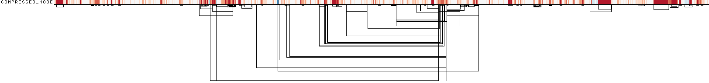
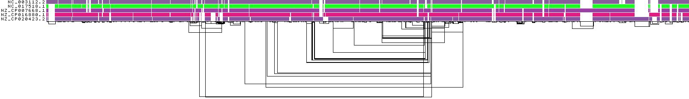
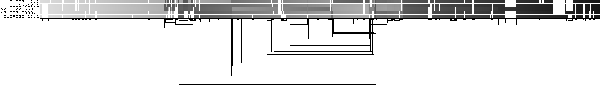
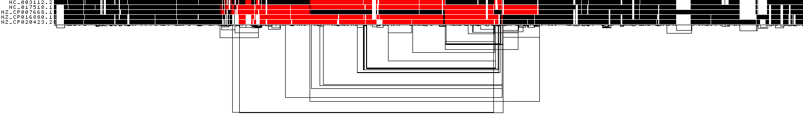
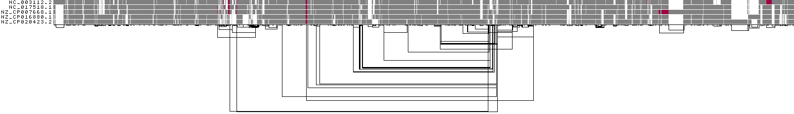
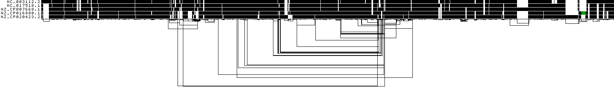
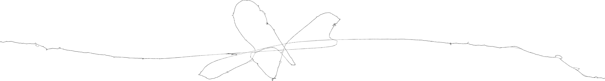
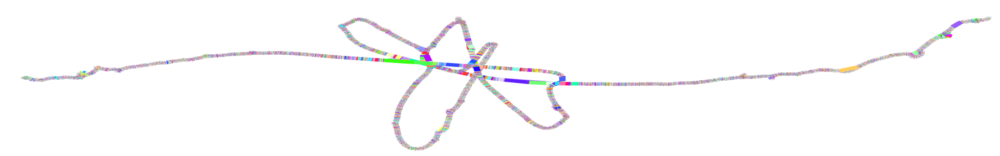

# 5. Evaluating output
- When we ran PGGB, the 'odgi stats -S' option was utilized to generate statistics for both the seqwish and smoothxg graphs and the 'multiqc -m' option was employed to generate a MultiQC report, providing comprehensive statistics and visualizations of the graphs. All pertinent results can be located in the MultiQC report, which is saved in HTML format.
- The output folder contains all the PGGB-related results, including the .smooth.final.og and all associated visualization figures. It also includes .final.smooth.gfa (a Graphical Fragment Assembly file), as well as variations of the graph presented in a VCF (Variant Call Format) file

## check the files 
!!! terminal "code"

    ```bash
    
    cd  ~/pg_workshop/5NM_2Kb94
    ```
    ```
    ls  
    ```
    ??? success "Output"
        ```bash 
        5NM.fa.fefc7f5.417fcdf.e2ae00b.smooth.07-24-2023_10:49:02.log         
        5NM.fa.fefc7f5.417fcdf.e2ae00b.smooth.07-24-2023_10:49:02.params.yml  
        5NM.fa.fefc7f5.417fcdf.e2ae00b.smooth.final.gfa                       
        5NM.fa.fefc7f5.417fcdf.e2ae00b.smooth.final.NC_017518.1.vcf           
        5NM.fa.fefc7f5.417fcdf.e2ae00b.smooth.final.NC_017518.1.vcf.stats     
        5NM.fa.fefc7f5.417fcdf.e2ae00b.smooth.final.og                        
        5NM.fa.fefc7f5.417fcdf.e2ae00b.smooth.final.og.lay                    
        5NM.fa.fefc7f5.417fcdf.e2ae00b.smooth.final.og.lay.draw_multiqc.png   
        5NM.fa.fefc7f5.417fcdf.e2ae00b.smooth.final.og.lay.draw.png           
        5NM.fa.fefc7f5.417fcdf.e2ae00b.smooth.final.og.lay.tsv                
        5NM.fa.fefc7f5.417fcdf.e2ae00b.smooth.final.og.stats.yaml             
        5NM.fa.fefc7f5.417fcdf.e2ae00b.smooth.final.og.viz_depth_multiqc.png
        5NM.fa.fefc7f5.417fcdf.e2ae00b.smooth.final.og.viz_inv_multiqc.png
        5NM.fa.fefc7f5.417fcdf.e2ae00b.smooth.final.og.viz_multiqc.png
        5NM.fa.fefc7f5.417fcdf.e2ae00b.smooth.final.og.viz_O_multiqc.png
        5NM.fa.fefc7f5.417fcdf.e2ae00b.smooth.final.og.viz_pos_multiqc.png
        5NM.fa.fefc7f5.417fcdf.e2ae00b.smooth.final.og.viz_uncalled_multiqc.png
        5NM.fa.fefc7f5.417fcdf.e2ae00b.smooth.fix.affixes.tsv.gz
        5NM.fa.fefc7f5.417fcdf.seqwish.og.stats.yaml
        5NM.fa.fefc7f5.alignments.wfmash.paf
        multiqc_config.yaml
        multiqc_data
        multiqc_report.html
        ```

## Check the statistics statistics for both the seqwish and smoothxg graphs
!!! info ""

    ```bash
	head -n5  5NM.fa.fefc7f5.417fcdf.seqwish.og.stats.yaml
	head -n5  5NM.fa.fefc7f5.417fcdf.e2ae00b.smooth.final.og.stats.yaml
    ```

    - Collate graph stats
    ```bash
    printf "Sample\tLength\tNodes\tEdges\tPaths\n"; awk 'FNR==1{if(NR>1) print name,len,nodes,edges,paths,comp; name=(FILENAME~/seqwish/?"seqwish":FILENAME~/smooth/?"smooth":FILENAME)}; /^length:/{len=$2} /^nodes:/{nodes=$2} /^edges:/{edges=$2} /^paths:/{paths=$2}; END{print name,len,nodes,edges,paths}' OFS='\t' *.og.stats.yaml
    ```
    ??? success "Output"
        ```bash 
		Sample  Length  Nodes   Edges   Paths
		smooth  2967578 245347  330791  5
		seqwish 3213544 122575  164967  5
		```

## check the .gfa file. 
- **(Graphical Fragment Assembly) GFA** is a file format commonly used to represent assembly graphs or sequence variation graphs

!!! terminal "code"

    ```bash
    
    head 5NM*.gfa | less -S 
    ```
    ??? success "Output"
        ```bash 
		H       VN:Z:1.0
		S       1       GTGGCTAAAACATATTTATTGACTGCATTGATAATGTCTATGACAATCTCTGGATGTCAAGTCATCCATGCCAATCA>
		L       1       +       2       +       0M
		L       1       +       3       +       0M
		S       2       C
		L       2       +       4       +       0M
		S       3       T
		L       3       +       4       +       0M
		S       4       CGAACAAAAGCAGGTGATTGCAAGTGATTTTATGGTAGCGTCAGCCAATCCATTAGCAACACAAGCTGGCTATGATA>
		L       4       +       6       +       0M
        ```
    ```bash
    
    tail 5NM*.gfa | less -S 
    ```
    ??? success "Output"
        ```bash 
		S       245456  A
		L       245456  +       245458  +       0M
		S       245457  G
		L       245457  +       245458  +       0M
		S       245458  TCGGCCAACCTTTCCACAGCTTTGGGTTAATGGTGAGTTAATCGGTGGTAGTGATATTATCCTACAAATGTACCAATCAGGTGAG>
		P       NC_003112.2#1#1   1+,2+,4+,5+,7+,8+,10+,12+,13+,14+,16+,18+,19+,21+,22+,23+,25+,26+,28+,29+,31+>
		P       NC_017518.1#1#1   1+,3+,4+,5+,7+,8+,10+,11+,13+,14+,16+,17+,19+,20+,22+,24+,25+,27+,28+,30+,31+>
		P       NZ_CP007668.1#1#1 1+,3+,4+,5+,7+,8+,10+,11+,13+,14+,16+,17+,19+,20+,22+,24+,25+,27+,28+,30+,31+>
		P       NZ_CP016880.1#1#1 1+,2+,4+,6+,7+,9+,10+,12+,13+,15+,16+,18+,19+,21+,22+,24+,25+,27+,28+,30+,31+>
		P       NZ_CP020423.2#1#1 1+,2+,4+,6+,7+,9+,10+,12+,13+,14+,16+,18+,19+,21+,22+,24+,25+,27+,28+,30+,31+>      
		```
    ??? clipboard-question "what does S, L, P mean"
        `S` means DNA segments, `L` means links between nodes, and `P` means paths

## Pangenome graph visualization using ODGI 

### ODGI Compressed 1D visualization
!!! info ""
  


This image shows a 1D rendering of the built pangenome graph. The graph nodes are arranged from left to right, forming the pangenome sequence. Summarization of path coverage across all paths. Dark blue means highest coverage. Dark red means lowest coverage. The path names are placed on the left. The black lines under the paths are the links, which represent the graph topology.

!!! terminal-2 "ODGI Compressed 1D visualization "

    ```bash
    odgi viz -i ./5NM.fa.fefc7f5.417fcdf.e2ae00b.smooth.final.og -o ./5NM.fa.fefc7f5.417fcdf.e2ae00b.smooth.final.og.viz_O_multiqc.png -x 1500 -y 500 -a 10 -O -I Consensus_  
    ```


### ODGI 1D visualization
!!! info ""
 


This image shows a 1D rendering of the built pangenome graph. The graph nodes are arranged from left to right, forming the pangenome sequence. The colored bars represent the paths versus the pangenome sequence in a binary matrix. The path names are placed on the left. The black lines under the paths are the links, which represent the graph topology.

!!! terminal-2 "ODGI Compressed 1D visualization"

    ```bash
    odgi viz -i ./5NM.fa.fefc7f5.417fcdf.e2ae00b.smooth.final.og -o ./5NM.fa.fefc7f5.417fcdf.e2ae00b.smooth.final.og.viz_multiqc.png -x 1500 -y 500 -a 10 -I Consensus_  
    ```


### ODGI 1D visualization by path position
!!! info ""




This shows a 1D rendering of the built pangenome graph where the paths are colored according to their nucleotide position. Light grey means a low path position, black is the highest path position.

!!! terminal-2 "ODGI Compressed 1D visualization"

    ```bash
    odgi viz -i ./5NM.fa.fefc7f5.417fcdf.e2ae00b.smooth.final.og -o ./5NM.fa.fefc7f5.417fcdf.e2ae00b.smooth.final.og.viz_pos_multiqc.png -x 1500 -y 500 -a 10 -u -d -I Consensus_ 
    ```


### ODGI 1D visualization by path orientation
!!! info ""


This image shows a 1D rendering of the built pangenome graph where the paths are colored by orientation. Forward is black, reverse is red.

!!! terminal-2 "ODGI Compressed 1D visualization"

    ```bash
    odgi viz -i ./5NM.fa.fefc7f5.417fcdf.e2ae00b.smooth.final.og -o ./5NM.fa.fefc7f5.417fcdf.e2ae00b.smooth.final.og.viz_inv_multiqc.png -x 1500 -y 500 -a 10 -z -I Consensus_
    ```
 


### 1D visualization by node depth
!!! info ""


This shows a 1D rendering of the built pangenome graph where the paths are colored according to path depth. Using the Spectra color palette with 4 levels of path depths, white indicates no depth, while grey, red, and yellow indicate depth 1, 2, and greater than or equal to 3, respectively.

!!! terminal "ODGI Compressed 1D visualization "

    ```bash
    odgi viz -i ./5NM.fa.fefc7f5.417fcdf.e2ae00b.smooth.final.og -o ./5NM.fa.fefc7f5.417fcdf.e2ae00b.smooth.final.og.viz_depth_multiqc.png -x 1500 -y 500 -a 10 -m -I Consensus_ 
    ```


### ODGI 1D visualization by uncalled bases
!!! info ""


This shows a 1D rendering of the built pangenome graph where the paths are colored according to the coverage of uncalled bases. The lighter the green, the higher the 'N' content of a node is.

!!! terminal-2 "ODGI Compressed 1D visualization "

    ```bash
    odgi viz -i ./5NM.fa.fefc7f5.417fcdf.e2ae00b.smooth.final.og -o ./5NM.fa.fefc7f5.417fcdf.e2ae00b.smooth.final.og.viz_uncalled_multiqc.png -x 1500 -y 500 -a 10 -N -I Consensus_ 
    ```


### ODGI 2D drawing 
!!! info ""

</center>


!!! terminal-2 "how to generate graph 2D visualization using odgi"

    - Compute the layout first
    ```bash
    odgi layout -i ./5NM.fa.fefc7f5.417fcdf.e2ae00b.smooth.final.og -o ./5NM.fa.fefc7f5.417fcdf.e2ae00b.smooth.final.og.lay -P -t 16
    ```

    - Retrieve the image
    ```bash
    odgi draw -i ./5NM.fa.fefc7f5.417fcdf.e2ae00b.smooth.final.og -c ./5NM.fa.fefc7f5.417fcdf.e2ae00b.smooth.final.og.lay -p ./5NM.fa.fefc7f5.417fcdf.e2ae00b.smooth.final.og.lay.draw.png
    ```

??? "Generate graph 2D visualization using gfaestus"
    
    https://github.com/chfi/gfaestus
    once you have it installed, you can use the following command to generate 2D visulization for a graph 
    
    ```bash
    gfaestus ${x}.gfa ${x}.gfa.tsv
    ```

    
		