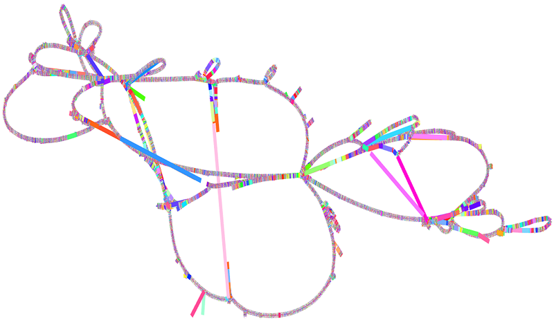

# Unlock the Power of Pangenome Graphs

.

## Learning Objectives
Participants in this course will gain an understanding of pangenome concepts and acquire hands-on experience in constructing and analyzing pangenome graphs. By the end of the course, they will have developed a comprehensive understanding of pangenome methods centered around whole genome assemblies. This will empower them to apply these methods to complex research questions that necessitate an understanding of the relationships between multiple genomes, or that require accounting for variability when analyzing new genomes.

!!! rectangle-list "Content"
    | **Lesson**                                        | **Overview** |  **Time**  |
    |:--------------------------------------------------|:-------------|:-----------|
    |[1. Intro](./1_Introduction_to_pangenome_graphs.md){ .md-button .md-button--primary }|Introduction to pangenome graphs| 30 min |
    |Break||10 min|
    |[2. Setup](./2_Tools_and_setup.md){ .md-button .md-button--primary }|Setup instructions for the tools and data used in this course | 30 min |
    |[3. PGGB](./3_Introduction_to_pggb.md){ .md-button .md-button--primary }|Introduction to the PGGB toolkit and its logic| 30 min |
    |Break||10 min|
    |[4. Running](./4_Running_pggb.md){ .md-button .md-button--primary }|Running the command to construct a graph and discuss key parameters| 45 min |
    |Lunch||45 min|
    |[5. Evaluate](./5_Evaluating_pggb_output.md){ .md-button .md-button--primary }|Evaluating the constructed graph through MultiQC reports| 60 min |
    |Break||10 min|
    |[6. Variants](./6_Variant_calling.md){ .md-button .md-button--primary }|Extracting variants from a graph| 45 min |
    |Break||10 min|
    |[7. Short reads](./7_Short_reads.md){ .md-button .md-button--primary }|Mapping short reads against a pangenome graph| 60 min |

!!! quote-right "Attribution notice"

- The workshop material was collaboratively prepared by Zoe Yang, Nuzla Ismail, Dinindu Senanayake, Jian Sheng Boey, Patrick J. Biggs, Mik Black, and Joep de Ligt
- The development of this workshop is supported by Genomics Aotearoa Genome Graphs project to Mik Black and Joep de Ligt

!!! quote-right "Acknowledgments"
- We extend our sincere appreciation to Assistant Professor Erik Garrison and his team at the University of Tennessee Health Science Center for their valuable guidance, suggestions, and feedback during the development of the pangenome graph pipeline.

## Further reading and Extracurricular materials
After this course you might want to learn more about pangenome graphs and start using them in your own research, below are some great resources to help with that.

Documentation:
- PGGB comes with rich documentation that explains key concepts and parameters: https://pggb.readthedocs.io/en/latest/index.html

Examples and lectures:
- MemPan23 hosted a 3 day course and semniar series, check out there resources and lectures: https://pangenome.github.io/MemPanG23/
